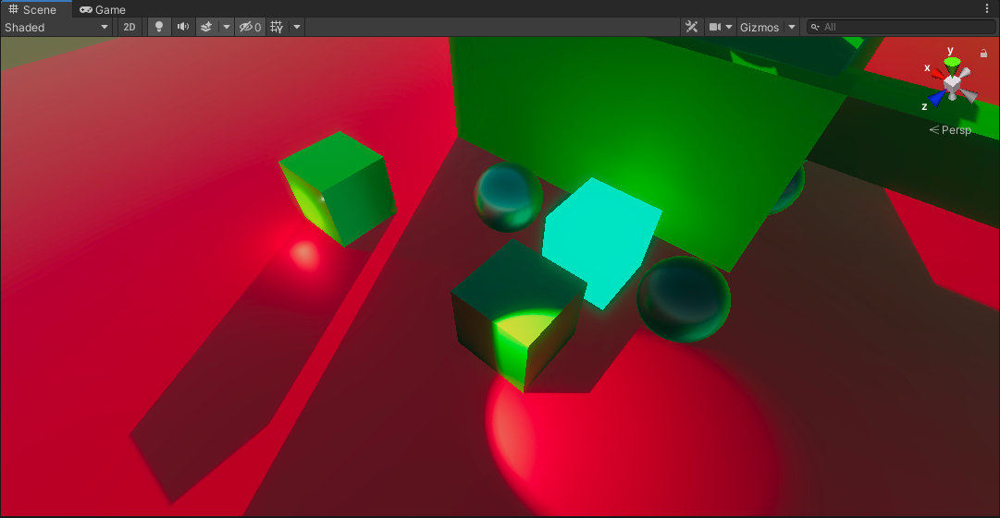
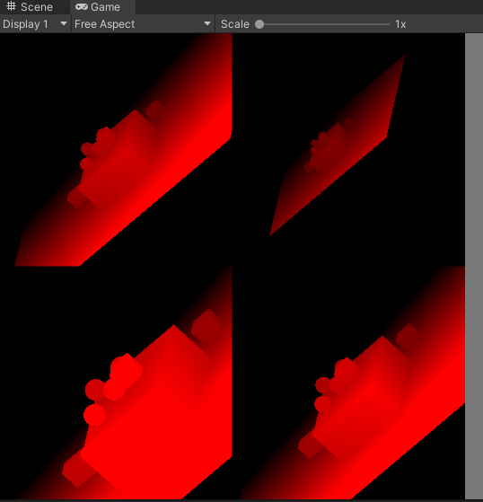
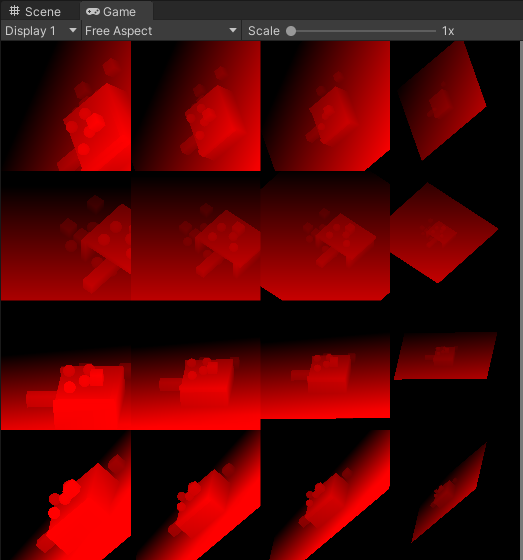
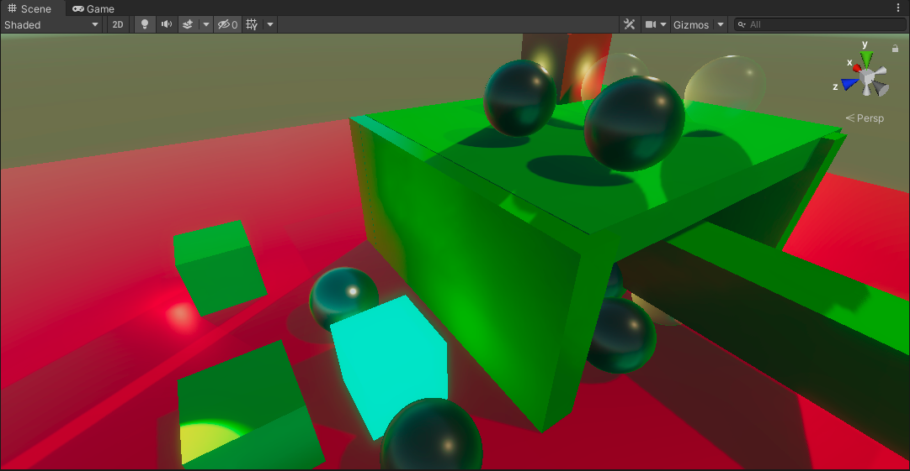
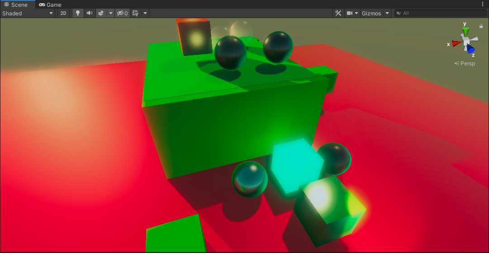
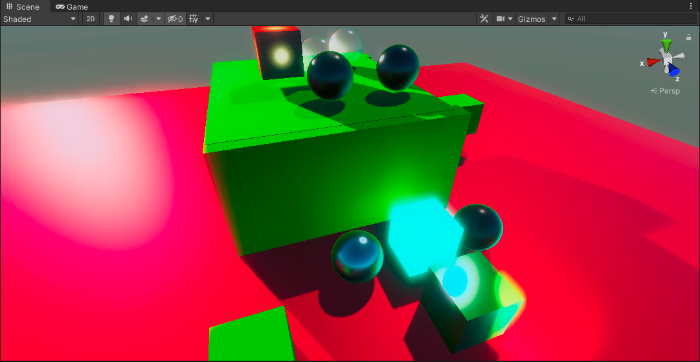
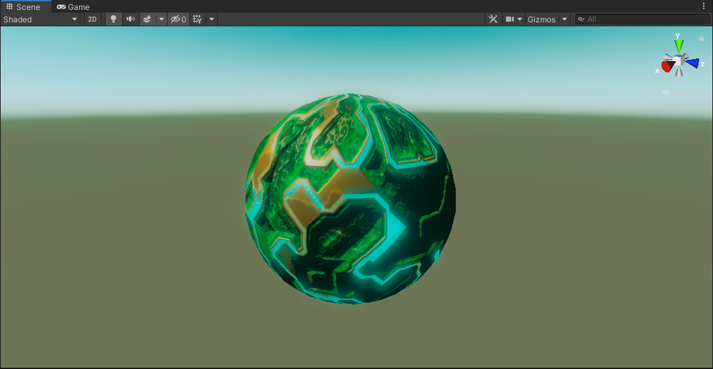
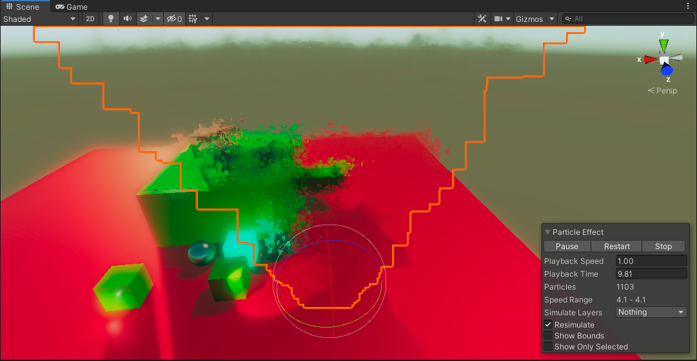

使用unity SRP，从零开始搭建的一套具有基本功能的渲染管线

### 方向光、点光源和聚光灯

### shadow map渲染实时阴影

单光源4层级联阴影

多光源级联阴影

支持法线偏差、百分比渐进滤波、级联过渡抖动等

### 烘焙光照

采样光照贴图、采样光照探针、编写meta pass、烘焙自发光、混合shadowMask与实时阴影、采样反射探针

### 后处理

bloom

颜色调整，后曝光、对比度、颜色滤镜、色调偏移、白平衡、色调分离、通道混合器等

### 复杂纹理

自发光纹理、MODS纹理、细节纹理、法线纹理

### 粒子

